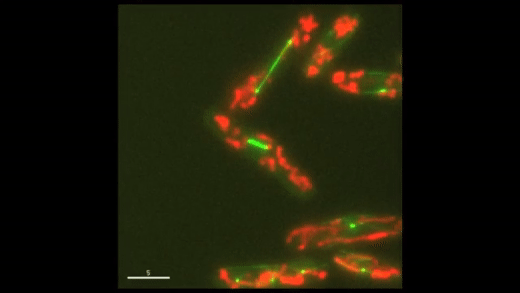
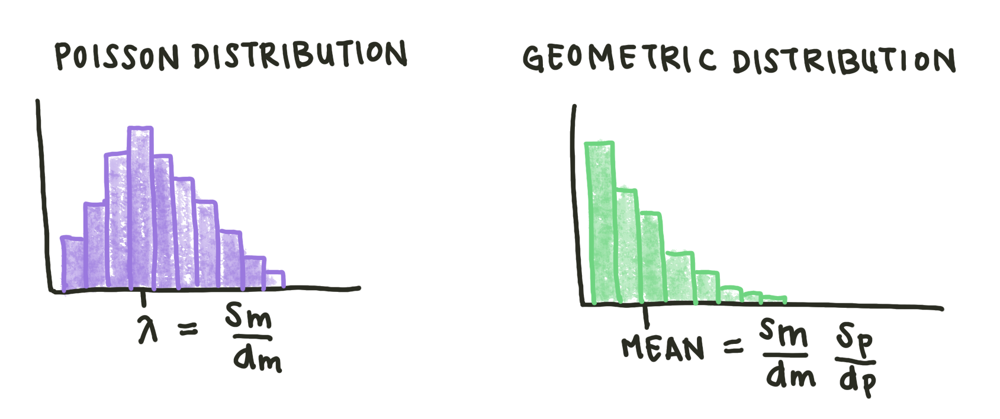

# Stochastic Modeling

One of the important assumptions of the differential equation models considered previously is a continuous distribution of the proteins or molecules of interest. In reality, cells contain only a finite (and usually quite small) number of a particular molecule. In some cases, we do not care to model individual cells: we may be able to consider a population of cells as a single unit, for instance in the case of a bulk bioreactor. However, for other applications we may want to examine gene expression in individual cells. Single-cell analysis is a growing family of techniques that allows scientists to study heterogeneous populations of cells and understand complex intercellular dynamics. 

To more adequately describe these **low-copy number dynamics**, we will use stochastic modeling. The system is quite similar to the one considered in the differential equations section [here](../differential-equations/differentialequations.md):

However, instead of using deterministic equations, we will model the probability of making a protein or mRNA molecule. The number of mRNA per cell cycle is distributed in a Poisson distribution, like many biological phenomena: 

$p(N) = \frac{\lambda^n}{n!}e^{-\lambda}$
 

 

A Poisson distribution is a distribution that models the number of events occuring within a given time interval (in this case, the length of a single cell cycle). $\lambda$ is the shape parameter, which indicates the average number of events in the time interval.

The mean number of proteins, on the other hand, is dependent on the number of mRNA molecules. For each time step, the mRNA molecule can either degrade or replicate into a protein:

Given a probability that an mRNA produces a protein $p$, the probability of producing 0, 1, 2, or N proteins is:

$P(0) = 1 - p$
$P(1) = p(1 - p)$
$P(2) = p^2(1 - p)$
$P(N) = p^N(1 - p)$
 

 

This mechanism results in a geometric distribution. Note that the mean number of proteins is actually not the most likely number in the cell.

It's important to note that while the number of protein/mRNA molecules in a cell is random, the *distribution* of these molecules is not. Therefore, we will model the deterministic way these probability distributions evolve over time in our model. To find the steady-state distributions, we will use the **Master equation**. Each state (number of molecules) is modeled with a separate deterministic equation. Examining the case of $n$ mRNA molecules:

$m_{n-1} \xrightleftharpoons[g_{n}]{f_{n-1}} m_n \xrightleftharpoons[g_{n+1}]{f_n} m_{n+1}$

$ \frac{\delta P(m_n)}{\delta t} = f_{n-1}m_{n-1} + g_{n+1}m_{n+1} - (f_n + g_n) m$

 

For the simple model we established, the only components of $f$ and $g$ are constant degradation and production. Therefore, $f_n$ is just $S_m$ and $g_m$ is $d_{m} n$. The number of mRNA in a cell $m_n$ is a Poisson distribution:

$m_n = \frac{S_m}{d_m}\frac{1}{n!}m_o \approx \frac{\lambda^n}{n!}e^{-\lambda}$
 

 

We can make similar equations for the protein distribution; however, we use a geometric distribution rather than a Poisson distribution.

A more complex model includes both mRNA and protein states. If $m$ is the number of mRNA and $n$ is the number of proteins, the possible states can be shown as a 2-dimensional matrix:

## Figure with equations including both

From the Master equation, we will have an infinite set of differential equations. To solve these equations, we can run simulations with many mRNA and protein initial conditions and plot the trajectories.

## Works Cited
https://www.youtube.com/watch?v=rBYYpPisjEs&ab_channel=OkinawaInstituteofScienceandTechnologyGraduateUniversity%28OIST%29